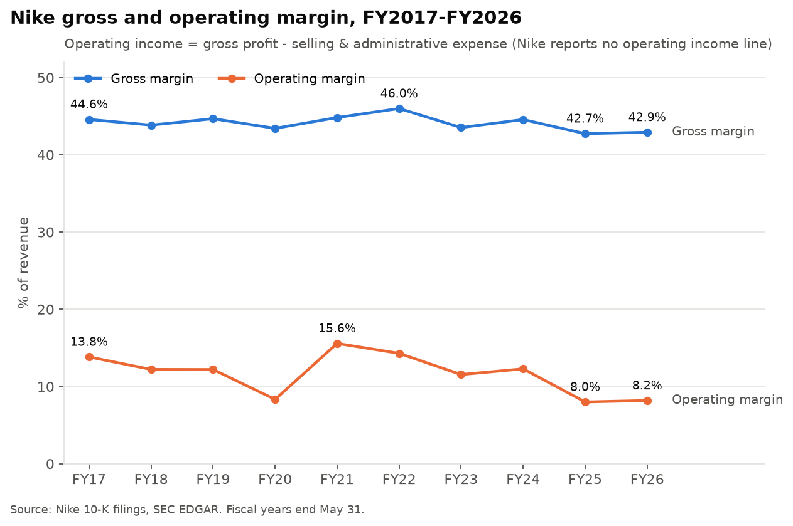
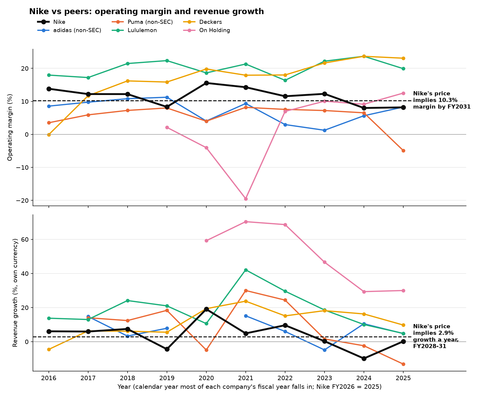

# Nike (NKE) valuation: all results in one place

Valuation date 2026-10-02 (share price $33.87); data as of 2026-10-04. Each section links to the file with the detail.
All figures are nominal (inflation included). The one DCF behind every number is
[`scripts/dcf_model.py`](../scripts/dcf_model.py), mirrored formula for formula in
[`05_nike_dcf_model.xlsx`](05_nike_dcf_model.xlsx), and script 06 checks that the two agree to the cent. Every input is
in [`scripts/assumptions.py`](../scripts/assumptions.py), with its source and date.

**Contents:** [1. The answer](#1-the-answer) · [2. What happened](#2-what-happened-to-nike) ·
[3. Model and inputs](#3-the-model-and-its-inputs) · [4. What the price implies](#4-what-the-price-implies) ·
[5. Nike's history](#5-nikes-own-history-fy1993-fy2026) · [6. Competitors](#6-competitors) ·
[7. Risks to the value](#7-what-could-lower-the-value) · [8. Peer multiples](#8-valuation-multiples-vs-peers) ·
[9. Guidance and scenarios](#9-nikes-fy2027-guidance-and-scenarios) · [10. Data audit](#10-data-audit) ·
[11. Limits](#11-limits-to-keep-in-mind)

## 1. The answer

Every DCF run fixes **FY2027 at Nike's own guidance** (8-K, 2026-10-01): revenue -8% (midpoint of the "high-single
digit" decline) and an adjusted operating margin of 5.55% (from adjusted EPS of $1.15-1.35).

| Question | Answer |
|---|---|
| What does the $33.87 price assume? | **After the guidance year, about 2.9% revenue growth a year (FY2028-31) and a 10.3% operating margin by FY2031** |
| How far back to "normal Nike" is that? | About 48% of the way from FY2026 (0.2% growth, 8.2% margin) to FY2017-24 (5.9% growth, 12.5% margin) |
| What is Nike worth in the base case? | **$42.17 a share**, 25% above the price (margin back to 12.5% by FY2031); a more cautious 10.5% margin gives $35.53 (section 9) |
| What would a full return to normal be worth? | About $45 a share |
| Lowest value with every harsher input at once | $33.58, 1% below the price |

My reading: from the guided FY2027 trough, the market prices a partial recovery to about a 10% margin, still below
Nike's FY2017-24 record and weaker than its recovery after the 1998-99 slump. That is interpretation; the numbers above
are model results.

## 2. What happened to Nike

Detail: [`02_what_happened.md`](02_what_happened.md), [`02_historical_metrics.csv`](02_historical_metrics.csv).

- Revenue grew from $34.4B (FY2017) to $51.4B (FY2024), then fell 9.8% in FY2025 and was flat in FY2026 at $46.4B.
- Operating margin (gross profit - S&A) fell from 12.3% (FY2024) to 8.0% (FY2025) and 8.2% (FY2026). That was 1.7
  points from lower gross margin and 2.4 points from S&A rising to 34.7% of revenue.
- Free cash flow fell from $6.6B to $2.2B, and ROIC from 45.7% to 22.0%, between FY2024 and FY2026.
- NIKE Direct peaked at 44% of NIKE Brand revenue (FY2023-24) and fell to 39%. Wholesale recovered to $27.5B.
  Greater China is down 29% from its peak, Converse is down 52%, and North America grew 4.8% in FY2026.

## 3. The model and its inputs

Detail: [`05_nike_dcf_model.xlsx`](05_nike_dcf_model.xlsx), [`04_wacc.csv`](04_wacc.csv).

| Input | Value | Source |
|---|---|---|
| Share price | $33.87 | Yahoo close, 2026-10-02 |
| Risk-free rate | 5.28% | 10-year Treasury, 2026-10-02 |
| Beta | 1.09 | 60 monthly returns vs S&P 500 |
| Equity risk premium | **4.09%** | Damodaran, 1 Sep 2026, verified in his data file |
| Cost of equity / after-tax cost of debt | 9.74% / 4.80% | CAPM; risk-free + 0.8% spread, 21% tax |
| **WACC** | **9.07%** | 86% equity, 14% debt (market weights) |
| Revenue growth FY2027-31 | -8%, 3%, 4%, 4%, 4% | FY2027 = Nike's guidance midpoint (8-K, 2026-10-01); later years judgment (FY2016-24 compound growth was 5.9%) |
| Operating margin | 5.55% in FY2027 → 12.5% by FY2031 | FY2027 from guidance (adjusted EPS, 25% tax); target = FY2017-24 average |
| Tax / D&A / capex / working capital | 18% / 1.7% / 2.0% / 11.5% of revenue | Nike FY2017-26 averages (10-Ks) |
| Terminal growth | 2.5% | FY2032 built as a normal 2.5%-growth year |
| Cash, debt, shares | $8.4B, $7.9B (excl. leases), 1,484.2m diluted | 10-Q, 2026-08-31 |

Terminal value is 77% of enterprise value, so the long run drives most of the answer.

## 4. What the price implies

Detail: [`06_implied_growth_and_margin_results.md`](06_implied_growth_and_margin_results.md),
[`04_reverse_dcf_results.md`](04_reverse_dcf_results.md).

One price can't pin down two unknowns, so each margin has its own implied growth rate (FY2027 fixed at guidance):

| Operating margin by FY2031 | 8% | 9% | 10% | 12.5% | 15% |
|---|---|---|---|---|---|
| Growth per year FY2028-31 the price implies | 11.1% | 7.1% | 3.7% | -2.9% | -7.9% |

The price mostly pins down the margin: each margin point is worth about $3-4 a share, while at a 12.5% margin going from
0% to 6% growth lifts the value only from $37 to $45. Reaching the margin a year earlier (FY2030) changes the implied
growth by about 0.5 points.

## 5. Nike's own history, FY1993-FY2026

Detail: [`06a_nike_history_fy1993_fy2026.csv`](06a_nike_history_fy1993_fy2026.csv),
[`06a_nike_downturns_and_recoveries.csv`](06a_nike_downturns_and_recoveries.csv) (from 10-Ks on EDGAR).

- Margin below the price-implied 10.3% in only five of 34 years: FY1998, FY1999, FY2020, FY2025 and FY2026. Growth of 2.9%+
  together with a 10.3%+ margin happened in 24 of 33 years.
- Today's slump is the deepest on record: -9.8% revenue in FY2025 and an 8.0% margin, with no rebound in FY2026.
- Outside shocks recovered fast: FY2010 and COVID took about a year. The slump most like today's (FY1998-99, Nike's own
  brand problems) took 4 years to a new revenue high and 8 years to get the margin back near 15%. In the four years
  after it, Nike still grew 5.1% a year with an 11.0% margin, better than what is priced in now.
- Separately reported one-offs (FY1998-2000 restructuring, FY2009 impairments) lower those years' margins further.
  Since FY2010 such costs sit inside S&A.

## 6. Competitors

Detail: [`06b_competitors_summary.csv`](06b_competitors_summary.csv). Reported operating margin, and compound growth in
each company's own currency:

| Company | Growth per year 2021→2025 | Avg margin 2022-25 | Margin 2025 | Source |
|---|---|---|---|---|
| Nike | -0.2% | 10.0% | 8.2% | SEC 10-K |
| adidas | 4.0% | 4.5% | 8.3% | annual report (non-SEC) |
| Puma | 1.8% | 4.1% | -4.9% | annual report (non-SEC) |
| Lululemon | 15.4% | 20.5% | 19.9% | SEC 10-K |
| Deckers | 14.8% | 21.6% | 23.1% | SEC 10-K |
| On Holding | 42.8% | 9.7% | 12.5% | SEC 20-F |

adidas and Puma figures are read directly from their 2025 annual report pages (downloaded by
`scripts/00_get_non_sec_files.py`). adidas's 2016-19 figures include Reebok and its 2020-25 figures exclude it, so its
2020 growth is left blank.

## 7. What could lower the value

Detail: [`07_valuation_risk_checks.md`](07_valuation_risk_checks.md).

| Change from the base case ($42.17) | Value per share | Change |
|---|---|---|
| Equity risk premium 5.0% | $37.05 | -$5.13 |
| Terminal growth 2.0% | $39.83 | -$2.35 |
| Tax rate 21% (FY2026 actual was 20.3%) | $40.56 | -$1.62 |
| Equity risk premium 4.23% (Damodaran, start of 2026) | $41.30 | -$0.87 |
| Working capital stays at 12.7% of revenue | $41.79 | -$0.39 |
| Leases ($3.2B) counted as debt, consistently | $42.55 | +$0.37 |
| Risk-free back at its 31 Aug level, 4.76% | $45.86 | +$3.69 |
| ERP 5.0%, tax 21%, working capital 12.7% and terminal growth 2.0% together | $33.58 | -$8.60 |

## 8. Valuation multiples vs peers

Detail: [`08_peer_multiples.xlsx`](08_peer_multiples.xlsx), [`08_peer_multiples_results.md`](08_peer_multiples_results.md).
Prices on 2026-10-02; last twelve months from each company's latest report (adidas: annual report 2025 + half-year
report 2026, non-SEC; the others SEC filings).

| Company | EV/EBITDA | P/E | Revenue growth, last 12 months | Revenue CAGR, 3 years | Operating margin |
|---|---|---|---|---|---|
| Nike | 11.0x | 16.3x | -1.2% | -3.2% | 8.2% |
| adidas | 10.6x | 18.3x | 6.3% | 3.3% | 8.4% |
| Lululemon | 3.7x | 7.5x | 1.7% | 11.0% | 17.8% |
| Deckers | 7.1x | 10.8x | 7.9% | 14.7% | 22.7% |
| On Holding | 15.7x | 21.7x | 18.5% | 35.1% | 13.8% |
| Under Armour | n.m. (loss) | n.m. (loss) | -3.6% | -5.6% | -2.4% |
| Peer median | 8.8x | 14.5x | 6.3% | 11.0% | 13.8% |

Enterprise value excludes leases and includes adidas's minority interests; adidas's and On's IFRS EBITDA has rent taken
back out so it matches US GAAP.

**What peer multiples say Nike is worth** ([`08_nike_value_from_peers.csv`](08_nike_value_from_peers.csv))

| Method | Multiple | Value per share | vs $33.87 |
|---|---|---|---|
| Peer median EV/EBITDA | 8.8x | $27.14 | -20% |
| Peer median P/E | 14.5x | $30.28 | -11% |
| Peer median EV/EBITDAR (leases as debt) | 9.1x | $30.10 | -11% |
| Peer range, EV/EBITDA (Lululemon to On) | 3.7x-15.7x | $11.51-$48.04 | |
| DCF base case | implies 13.8x EV/EBITDA, 20.2x P/E | $42.17 | +25% |

The DCF's value needs a multiple on today's profit above every peer but On, which grows 18% a year. The gap is the DCF's
margin recovery (5.55% in FY2027 to 12.5% by FY2031): peers price Nike's current profit, the DCF prices its recovered profit.

## 9. Nike's FY2027 guidance and scenarios

Detail: [`scripts/10_memo_scenarios.py`](../scripts/10_memo_scenarios.py), [`10_memo_scenarios.csv`](10_memo_scenarios.csv),
[`10_guidance_margin.csv`](10_guidance_margin.csv).

Nike's Q1 FY2027 earnings release (8-K, 2026-10-01, saved in `data/raw/8k/`) guides FY2027 revenue down "high-single
digits" and adjusted EPS of $1.15-1.35 (27x at $33.87), which implies an adjusted FY2027 operating margin of about 5.6%.
The base case and every reverse DCF use it for FY2027.

| Scenario | Growth FY2028-31 | Margin by FY2031 | Value per share | vs price |
|---|---|---|---|---|
| Bear | 0%, 2%, 2%, 2% | 7.5% | $23.90 | -29% |
| Cautious base | 3%, 4%, 4%, 4% | 10.5% | $35.53 | +5% |
| Bull | 5%, 6%, 6%, 5% | 12.5% | $44.65 | +32% |
| Model base case | 3%, 4%, 4%, 4% | 12.5% | $42.17 | +25% |

With 3/4/4/4% growth after FY2027, the price needs a 10.0% FY2031 margin. The audit (script 09) checks the guidance
figures against the release text.

## 10. Data audit

Detail: [`scripts/09_data_audit.py`](../scripts/09_data_audit.py), [`09_data_audit.csv`](09_data_audit.csv).
256 checks, no failures (13 values of 0 or under 10 were too small to search for):

- 220 Nike figures for FY2017-FY2026 (revenue, profit lines, cash flow, balance sheet, D&A, diluted shares) found
  next to their row labels in Nike's own 10-K documents, independently of the SEC data API they came from.
- 13 figures from the Q1 FY2027 10-Q (balance sheet, shares, the quarter used in the last-twelve-month figures);
  the diluted share count is within 0.1% of the 1,485.3m shares on the 10-Q cover.
- 11 market inputs (Nike and peer prices, Treasury yield, beta recomputed, Damodaran ERP, exchange rates) match the raw downloads.
- 8 consistency checks: the Excel and Python DCFs agree to the cent; scripts 02, 06b and 08 read the same revenues.
- Re-running scripts 02 to 10 from the raw files rebuilds every output CSV unchanged.

## 11. Limits to keep in mind

- **FY2027 is set from Nike's guidance, not from an independent forecast.** The 5.55% margin is adjusted (before about
  $0.3B of Pace restructuring charges) and rests on reading "high-single digits" as -8% and "mid-20s" tax as 25%.
- The growth path and the 12.5% margin target are judgment, and they drive the base-case value more than any input
  above. The reverse DCF (section 4) avoids them by asking what the price implies instead.
- adidas's last-twelve-month lease depreciation and lease interest are its 2025 figures (the half-year report doesn't
  split them out).
- Peer figures rest on each company's own XBRL data (SEC) or report (adidas); unlike Nike's, they were not re-checked
  line by line against the printed filings.
- Nike's figures before FY2008 were never restated for later acquisitions and sales (Converse, Umbro), so growth in
  those years includes some acquisition effect.
- Shares are the quarter's diluted weighted average; the SEC data has no period-end count. The difference is under 1%.
- Peers use different fiscal years. Each is aligned to the calendar year most of its fiscal year falls in.

How to re-run everything is in the [README](../README.md#how-to-run-it). How the model and its results changed while
the project was built is in the [changelog](../CHANGELOG.md).
