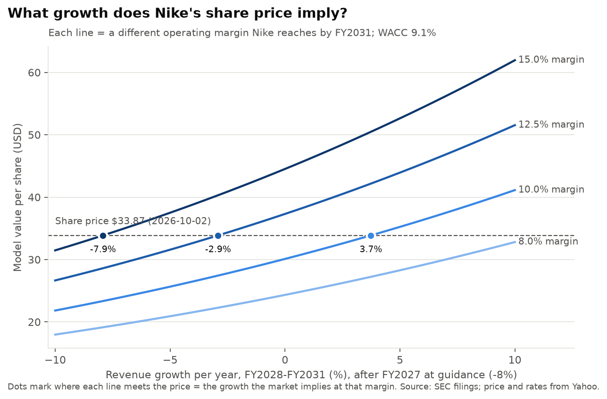

# Nike reverse DCF: what is $33.87 pricing in?

Built by `scripts/03_market_inputs.py` (market data, beta) and `scripts/04_reverse_dcf.py` (solver).
The model is the project's one DCF, `scripts/dcf_model.py`, the same one the Excel workbook (script 05) and
script 06 use. All assumptions are in `scripts/assumptions.py`. Valuation date 2026-10-02. Last updated 2026-10-04.

**FY2027 is fixed at Nike's own guidance** in every run: revenue -8% (midpoint of the "high-single digit" decline) and
an adjusted operating margin of 5.55%, worked out from the adjusted EPS guidance of $1.15-1.35 (Q1 FY2027 earnings
release, 8-K filed 2026-10-01; steps in `output/10_guidance_margin.csv`). So the unknown the solver looks for is
revenue growth in **FY2028-FY2031**. The fuller analysis, with both growth and margin unknown, is in
`output/06_implied_growth_and_margin_results.md`.

## The answer

At a 9.07% discount rate, Nike's price of $33.87 is what the model gives for any of these pairs of FY2028-FY2031
revenue growth (the same rate every year, after FY2027's -8%) and the operating margin Nike reaches by FY2031:

| Operating margin by FY2031 | Revenue growth per year FY2028-31 the price implies |
|---|---|
| 8.0% (about where FY2026 was) | 11.1% |
| 10.0% (partial recovery) | 3.7% |
| 12.5% (back to the FY2017-24 average) | -2.9% |
| 15.0% (better than ever) | -7.9% |

For comparison, over FY2017-FY2024 Nike's revenue grew 5.9% a year (compound) and its operating margin averaged 12.5%.
Returning to both after the guidance year is worth about $45 a share in this model. So the market is not pricing in a
full return to the old Nike, but it does need the margin to climb well above the guided 5.55%: staying near 8% would
take double-digit growth.

## How sensitive this is

Implied revenue growth per year FY2028-31 (%), by margin and discount rate (WACC):

| Margin by FY2031 | WACC 8.07% | WACC 9.07% | WACC 10.07% |
|---|---|---|---|
| 8.0% | 5.4 | 11.1 | 16.4 |
| 10.0% | -1.5 | 3.7 | 8.6 |
| 12.5% | -7.7 | -2.9 | 1.5 |
| 15.0% | -12.4 | -7.9 | -3.8 |

A 1-point change in WACC moves the implied growth by about 4.5-5.5 points, about as much as a 1.5-2 point change in
margin. The discount rate matters as much as the business assumptions.

## How the model works (one line per step)

1. **Discount rate (WACC) = 9.07%.** Cost of equity = 5.28% risk-free + 1.09 beta x 4.09% equity risk premium = 9.74%.
   After-tax cost of debt = (5.28% + 0.8%) x (1 - 21%) = 4.80%. Weighted 86% equity ($50.3B market value) and 14% debt ($7.9B).
   (`output/04_wacc.csv`)
2. **Starting point.** FY2026 revenue $46.4B and operating working capital $5.9B (10-K). Cash + short-term investments
   $8.4B, debt $7.9B and 1,484.2m diluted shares from the Q1 FY2027 10-Q (2026-08-31).
   (`output/04_latest_balance_sheet_and_shares.csv`)
3. **Forecast FY2027-FY2031.** FY2027: revenue -8% and margin 5.55% (guidance). FY2028-31: revenue grows at the unknown
   rate g, and the margin moves in a straight line from 5.55% to the target by FY2031. NOPAT = operating income x
   (1 - 18% tax). Free cash flow (FCFF) = NOPAT + D&A (1.7% of revenue) - capex (2.0%) - the increase in working
   capital (11.5% of revenue).
4. **Discounting.** Each year's FCFF is divided by (1 + WACC) raised to the years between today and that fiscal year-end.
   Only 75% of FY2027 counts, since June-August 2026 has already happened and its cash is in the balance sheet.
5. **Terminal value.** FY2032 is built as a normal year with 2.5% revenue growth, and its FCFF grows 2.5% a year forever:
   value = FY2032 FCFF / (WACC - 2.5%). It is 77% of enterprise value at the 12.5%-margin answer.
6. **Equity per share** = (enterprise value + cash - debt) / shares.
7. **Solve.** The script tries growth rates until value per share equals $33.87 (bisection). The check row in
   `output/04_valuation_summary.csv` shows the gap is under $0.001. Year-by-year table: `output/04_forecast_at_implied_growth.csv`.

## Weak spots to know about

- **FY2027 rests on reading Nike's guidance**: "high-single digits" as -8% and "mid-20 percent" tax as 25%. The 5.55%
  margin is adjusted, before about $0.3B of Pace restructuring charges, so reported FY2027 profit will be lower.
- **Equity risk premium (4.09%)** is Damodaran's 1 September 2026 figure, his latest before the valuation date, verified
  on 2026-10-04 against his data file (`data/raw/damodaran/ERPbymonth.xlsx`). It was 4.23% at the start of 2026; at
  4.23% the 12.5%-margin answer would be -2.3% instead of -2.9%.
- **The risk-free rate is high (5.28%)**, which pushes WACC up and implied growth up with it.
- **Shrinking revenue releases working capital** in this model, which slightly flatters the negative-growth cases.
- **Shares** are the quarter's diluted weighted average, not the exact August 31 count (the SEC data file lacks it).
- **Leases** are left out of debt, consistently with operating income (lease cost is already inside selling & administrative expense).
- **Everything is nominal:** growth rates, cash flows and the discount rate all include inflation.
